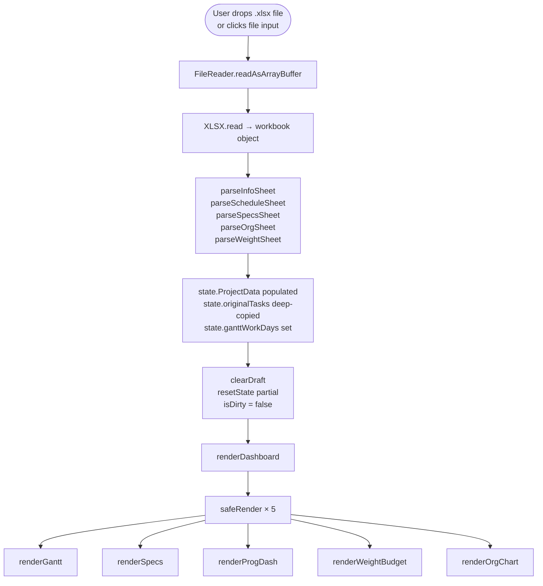
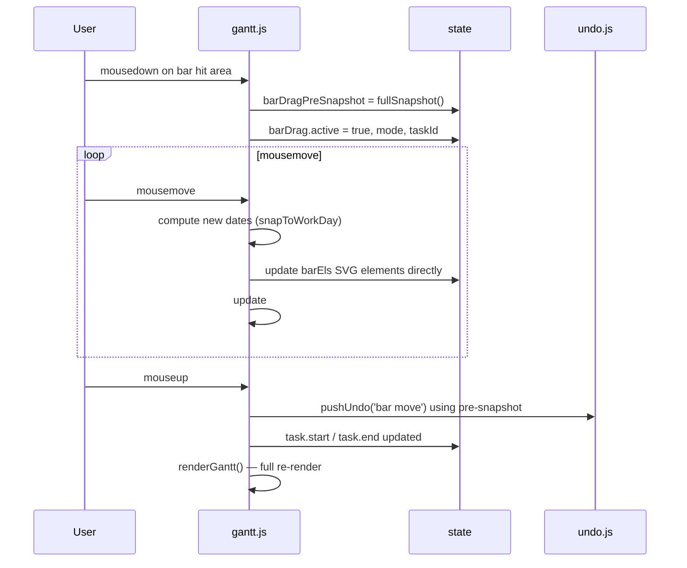
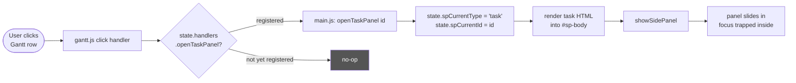
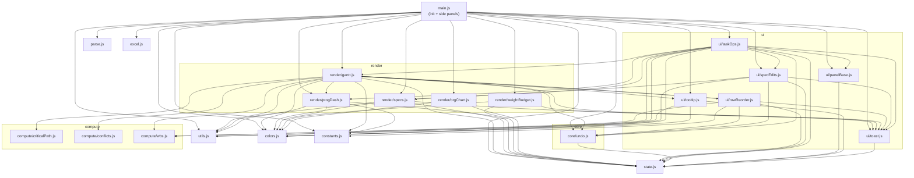
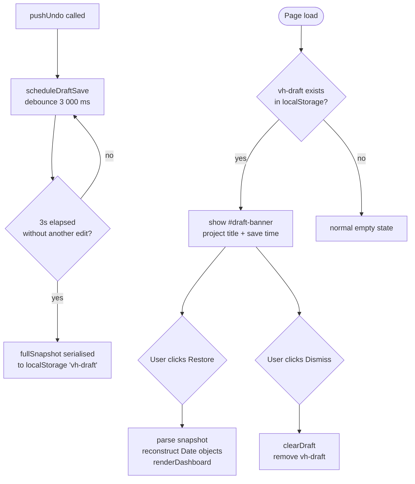

# Code Flow Diagrams

Key data flows through the app. Rendered as Mermaid diagrams (GitHub, VS Code, Obsidian all render these natively).

---

## 1. File load

How an Excel file becomes a rendered dashboard.

---

## 2. Gantt bar drag

How moving a bar updates the schedule.

---

## 3. Side panel open

How clicking a task row opens the task panel without a circular import.

**Why `state.handlers`?** `gantt.js` imports from `main.js` would create a circular dependency. Instead, `main.js` writes `state.handlers.openTaskPanel = openTaskPanel` at init time, and `gantt.js` reads it at call time — by then the function is registered.

---

## 4. Inline field edit (spec panel)

The pattern used by all seven `startSpec*Edit` functions.

```mermaid
sequenceDiagram
    participant User
    participant specEdits.js
    participant state
    participant undo.js
    participant specs.js

    User->>specEdits.js: click on spec name cell
    specEdits.js->>specEdits.js: replace <span> with <input>\nfocus + select all
    User->>specEdits.js: types new name, presses Enter
    specEdits.js->>undo.js: pushUndo('spec name change')
    specEdits.js->>state: spec.name = newValue
    specEdits.js->>specs.js: renderSpecTable()
    specEdits.js->>state: spCurrentType = null
    specEdits.js->>state.handlers: openSpecPanel(spec.id)
    Note over specEdits.js: Panel re-renders with updated value.\nspCurrentType nulled so it's a fresh\nopen, not a toggle-close.
```

---

## 5. Undo / redo

```mermaid
flowchart TD
    subgraph Every edit
        A[pushUndo label] --> B[fullSnapshot → deep copy of\ntasks, specs, org, weights, info]
        B --> C[undoStack.push snapshot + label\nredoStack cleared\nisDirty = true\nscheduleDraftSave debounced 3s]
    end

    subgraph Undo
        D([User presses Ctrl+Z]) --> E[currentSnapshot = fullSnapshot]
        E --> F[redoStack.push currentSnapshot]
        F --> G[entry = undoStack.pop]
        G --> H[_restoreSnapshot entry.snapshot]
        H --> I[safeRender all tabs]
    end

    subgraph Redo
        J([User presses Ctrl+Y]) --> K[currentSnapshot = fullSnapshot]
        K --> L[undoStack.push currentSnapshot]
        L --> M[entry = redoStack.pop]
        M --> N[_restoreSnapshot entry.snapshot]
        N --> O[safeRender all tabs]
    end
```

---

## 6. Module dependency graph

Who imports from whom. Arrows point from importer → imported.

> **Note on rowReorder ↔ gantt circular edge:** `rowReorder.js` imports `renderGantt` from `gantt.js`, and `gantt.js` imports `startRowDrag/doRowDragMove/endRowDrag` from `rowReorder.js`. Vite/Rollup resolves this safely because neither module reads the other's exports at module-init time — they only call them inside event handlers (runtime, not import time).

---

## 7. Draft auto-save and restore

